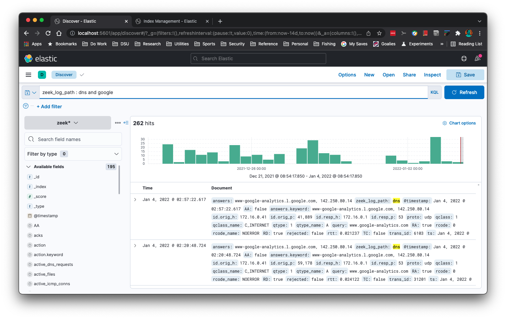
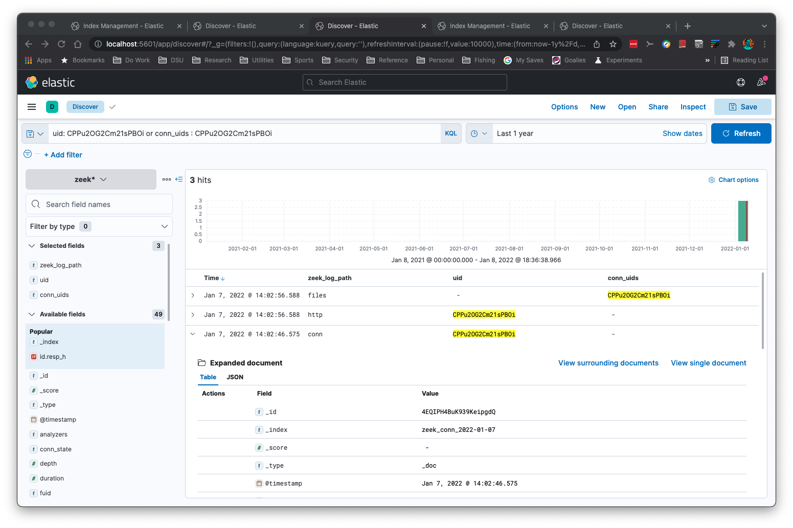
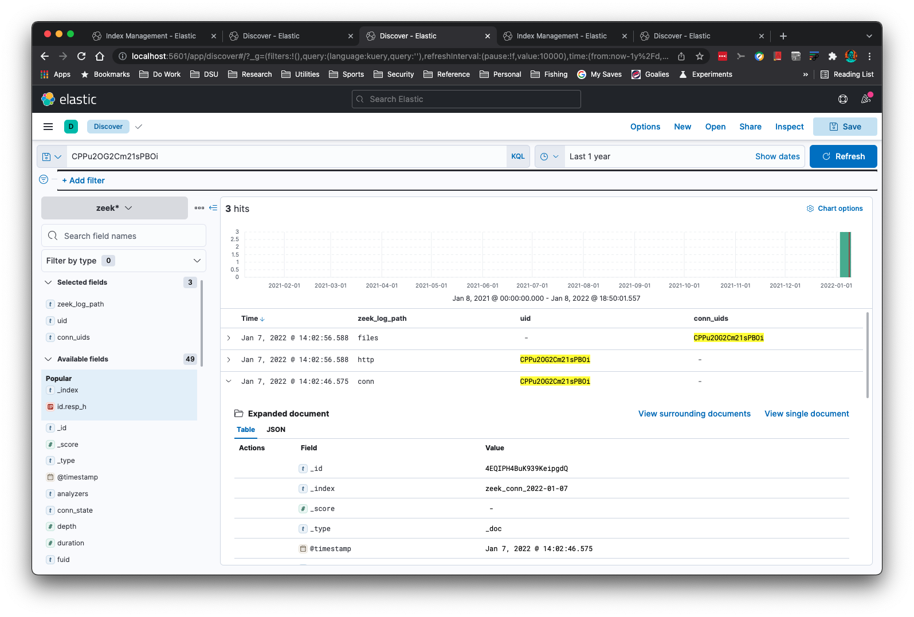
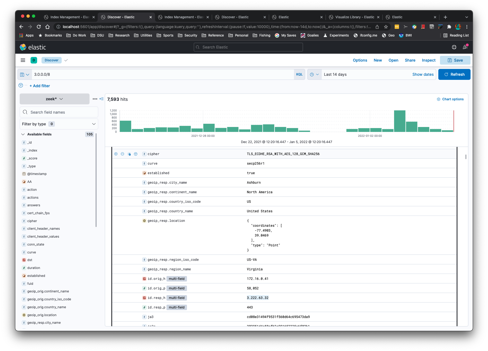
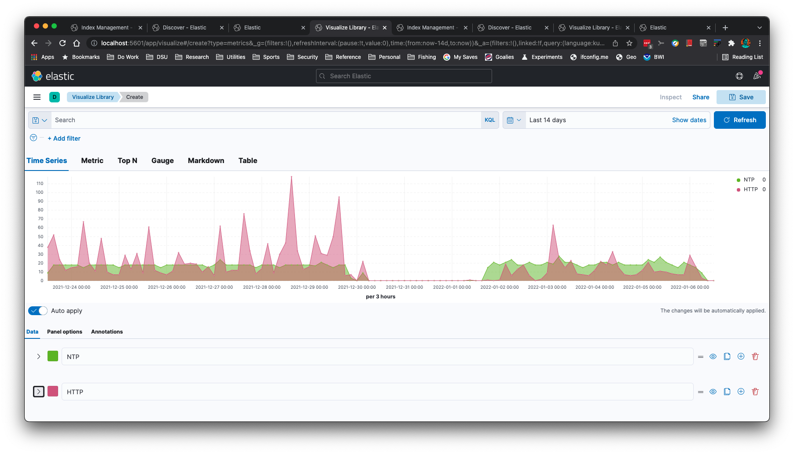
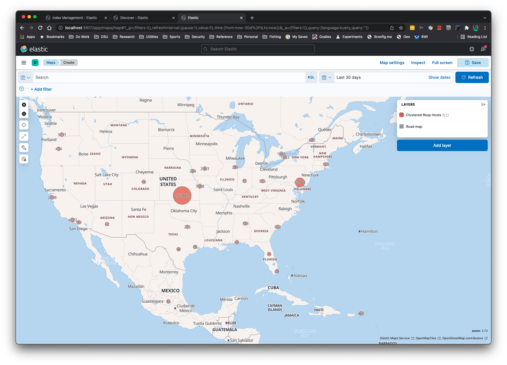

# zeek2es.py

This Python application translates [Zeek's](https://zeek.org/) ASCII TSV and JSON
logs into [ElasticSearch's bulk load JSON format](https://www.elastic.co/guide/en/elasticsearch/reference/current/getting-started.html#add-multiple-documents).

## Table of Contents:
- [Introduction](#introduction)
- [Installation](#installation)
- [Upgrading zeek2es](#upgradingzeek2es)
  - [ES Ingest Pipeline](#esingestpipeline)
- [Filtering Data](#filteringdata)
- [Command Line Examples](#commandlineexamples)
- [Command Line Options](#commandlineoptions)
- [Requirements](#requirements)
- [Notes](#notes)
  - [JSON Log Input](#jsonloginput)
  - [Data Streams](#datastreams)
  - [Cython](#cython)

## Introduction <a name="introduction" />



Want to see multiple Zeek logs for the same connection ID (uid)
or file ID (fuid)?  Here are the hits from files.log, http.log, and
conn.log for a single uid:



Or you could just simply use the uid (or fuid) you are looking for in all logs:



You can perform subnet searching on Zeek's 'addr' type:



You can create time series graphs, such as this NTP and HTTP graph:



IP Addresses can be Geolocated with the `-g` command line option:



Aggregations are simple and quick:


This application will "just work" when Zeek log formats change.  The logic reads
the field names and associated types to set up the mappings correctly in
ElasticSearch.

This application will recognize gzip or uncompressed logs.  This application assumes 
you have ElasticSearch set up on your localhost at the default port.
If you do not have ElasticSearch you can output the JSON to stdout with the `-s -b` command line options
to process with the [jq application](https://stedolan.github.io/jq).

You can add a keyword subfield to text fields with the `-k` command line option.  This is useful
for aggregations in Kibana.

Also, no other Python libraries are needed to run this application.  If Python
is already on your system, there is nothing additional for you to copy over
to your machine than [Elasticsearch, Kibana](https://www.elastic.co/start), and [zeek2es.py](zeek2es.py).

## Installation: <a name="installation" />

There is none.  You just copy [zeek2es.py](zeek2es.py) to your host and run it with Python.  Once Zeek
logs have been imported with automatic index name generation (meaning, you did not supply the `-i` option)
you will find your indices named "zeek_`zeeklogname`_`date`", where `zeeklogname` is a log name like `conn`
and the `date` is in `YYYY-MM-DD` format.  Set your Kibana index pattern to match `zeek*` in this case.  If
you named your index with the `-i` option, you will need to create a Kibana index pattern that 
matches your naming scheme.

If you are upgrading zeek2es, please see [the section on upgrading zeek2es](#upgradingzeek2es).

## Upgrading zeek2es <a name="upgradingzeek2es" />

Most upgrades should be as simple as copying the newer [zeek2es.py](zeek2es.py) over 
the old one.  In some cases, the ES ingest pipeline required for the `-g` command line option 
might change during an upgrade.  Therefore, it is strongly recommend you delete 
your [ingest pipeline](#esingestpipeline) before you run a new version of zeek2es.py.

### ES Ingest Pipeline <a name="esingestpipeline" />

If you need to [delete the "zeekgeoip" ES ingest pipeline](https://www.elastic.co/guide/en/elasticsearch/reference/current/delete-pipeline-api.html) 
used to geolocate IP addresses with the `-g` command line option, you can either do it graphically
through Kibana's Stack Management->Ingest Pipelines or this command will do it for you:

```
curl -X DELETE "localhost:9200/_ingest/pipeline/zeekgeoip?pretty"
```

This command is strongly recommended whenever updating your copy of zeek2es.py.

## Filtering Data: <a name="filteringdata" />

zeek2es provides filtering capabilities for your Zeek logs before they are stored in ElasticSearch.  This
functionality can be enabled with the `-a` or `-f` options.  The filters are constructed from Python
lambda functions, where the input is a Python dictionary representing the output.  You can add a 
filter to only store connection logs where the `service` field is populated using the `-f` option with
this lambda filter file:

```
lambda x: 'service' in x and len(x['service']) > 0
```

Or maybe you'd like to filter for connections that have at least 1,024 bytes, with at least 1 byte coming from 
the destination:

```
lambda x: 'orig_ip_bytes' in x and 'resp_ip_bytes' in x and x['orig_ip_bytes'] + x['resp_ip_bytes'] > 1024 and x['resp_ip_bytes'] > 0
```

Simpler lambda filters can be provided on the command line via the `-a` option.  This filter will only store 
connection log entries where the originator IP address is part of the `192.0.0.0/8` network:

```
python zeek2es.py conn.log.gz -a "lambda x: 'id.orig_h' in x and ipaddress.ip_address(x['id.orig_h']) in ipaddress.ip_network('192.0.0.0/8')"
```

## Command Line Examples: <a name="commandlineexamples" />

```
python zeek2es.py your_zeek_log.gz -i your_es_index_name
```

This script can be run in parallel on all connection logs, 10 at a time, with the following command:

```
find /some/dir -name “conn*.log.gz” | parallel -j 10 python zeek2es.py {1} :::: -
```

If you would like to automatically import all conn.log files as they are created in a directory, the following
[fswatch](https://emcrisostomo.github.io/fswatch/) command will do that for you:

```
fswatch -m poll_monitor --event Created -r /data/logs/zeek/ | awk '/^.*\/conn.*\.log\.gz$/' | parallel -j 5 python ~/zeek2es.py {} -g -d :::: -
```

If you have the jq command installed you can perform searches across all your logs for a common
field like connection uid, even without ElasticSearch:

```
find /usr/local/var/logs -name "*.log.gz" -exec python ~/Source/zeek2es/zeek2es.py {} -s -b -z \; | jq -c '. | select(.uid=="CLbPij1vThLvQ2qDKh")'
```

You can use much more complex jq queries than this if you are familiar with jq.

If you want to remove all of your Zeek data from ElasticSearch, this command will do it for you:

```
curl -X DELETE http://localhost:9200/zeek*
```

Since the indices have the date appended to them, you could
delete Dec 31, 2021 with the following command:

```
curl -X DELETE http://localhost:9200/zeek_*_2021-12-31
```

You could delete all conn.log entries with this command:

```
curl -X DELETE http://localhost:9200/zeek_conn_*
```

## Command Line Options: <a name="commandlineoptions" />

```
$ python zeek2es.py -h
usage: zeek2es.py [-h] [-i ESINDEX] [-u ESURL] [-l LINES] [-n NAME] [-k KEYWORDS] [-a LAMBDAFILTER] [-f LAMBDAFILTERFILE] [-y OUTPUTFIELDS] [-d DATASTREAM] [-g] [-j] [-r] [-t] [-s] [-b] [-c] [-z] filename

Process Zeek ASCII logs into Elasticsearch.

positional arguments:
  filename              The Zeek log in *.log or *.gz format. Include the full path.

optional arguments:
  -h, --help            show this help message and exit
  -i ESINDEX, --esindex ESINDEX
                        The Elasticsearch index name.
  -u ESURL, --esurl ESURL
                        The Elasticsearch URL. (default: http://localhost:9200/)
  -l LINES, --lines LINES
                        Lines to buffer for RESTful operations. (default: 10,000)
  -n NAME, --name NAME  The name of the system to add to the index for uniqueness. (default: empty string)
  -k KEYWORDS, --keywords KEYWORDS
                        A comma delimited list of text fields to add a keyword subfield. (default: service)
  -a LAMBDAFILTER, --lambdafilter LAMBDAFILTER
                        A lambda function, when eval'd will filter your output JSON dict. (default: empty string)
  -f LAMBDAFILTERFILE, --lambdafilterfile LAMBDAFILTERFILE
                        A lambda function file, when eval'd will filter your output JSON dict. (default: empty string)
  -y OUTPUTFIELDS, --outputfields OUTPUTFIELDS
                        A comma delimited list of fields to keep for the output. Must include ts. (default: empty string)
  -d DATASTREAM, --datastream DATASTREAM
                        Instead of an index, use a data stream that will rollover at this many GB. Recommended is 50. (default: 0 - disabled)
  -g, --ingestion       Use the ingestion pipeline to do things like geolocate IPs and split services. Takes longer, but worth it.
  -j, --jsonlogs        Assume input logs are JSON.
  -r, --origtime        Keep the numerical time format, not milliseconds as ES needs.
  -t, --timestamp       Keep the time in timestamp format.
  -s, --stdout          Print JSON to stdout instead of sending to Elasticsearch directly.
  -b, --nobulk          Remove the ES bulk JSON header. Requires --stdout.
  -c, --cython          Use Cython execution by loading the local zeek2es.so file through an import. Run python setup.py build_ext --inplace first to make your zeek2es.so file!
  -z, --supresswarnings
                        Supress any type of warning. Die stoically and silently.
```

## Requirements: <a name="requirements" />

- A Unix-like environment (MacOs works!)
- Python

## Notes: <a name="notes" />

### JSON Log Input <a name="jsonloginput" />

Since Zeek JSON logs do not have type information like the ASCII TSV versions, only limited type information 
can be provided to ElasticSearch.  You will notice this most for Zeek "addr" log fields that 
are not id$orig_h and id$resp_h, since the type information is not available to translate the field into 
ElasticSearch's "ip" type.  Since address fields will not be of type "ip", you will not be able to use 
subnet searches, for example, like you could for the TSV logs.  Saving Zeek logs in ASCII TSV 
format provides for greater long term flexibility.

### Data Streams <a name="datastreams" />

You can use data streams instead of indices for large logs with the `-d` command line option.  This
option creates index templates beginning with `zeek_`.  It also creates a lifecycle policy
named `zeek-lifecycle-policy`.  If you would like to delete all of your data streams, lifecycle policies,
and index templates, these commands will do it for you:

```
curl -X DELETE http://localhost:9200/_data_stream/zeek*?pretty
curl -X DELETE http://localhost:9200/_index_template/zeek*?pretty
curl -X DELETE http://localhost:9200/_ilm/policy/zeek-lifecycle-policy?pretty
```

### Cython <a name="cython" />

If you'd like to try [Cython](https://cython.org/), you must run `python setup.py build_ext --inplace` 
first to generate your compiled file.  You must do this every time you update zeek2es!