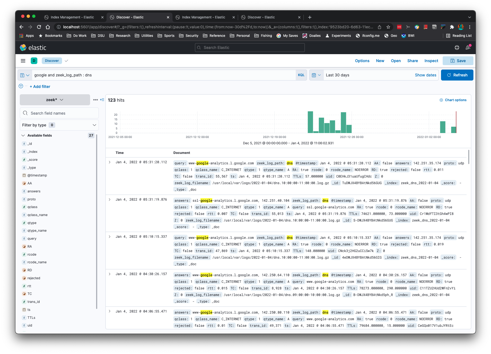
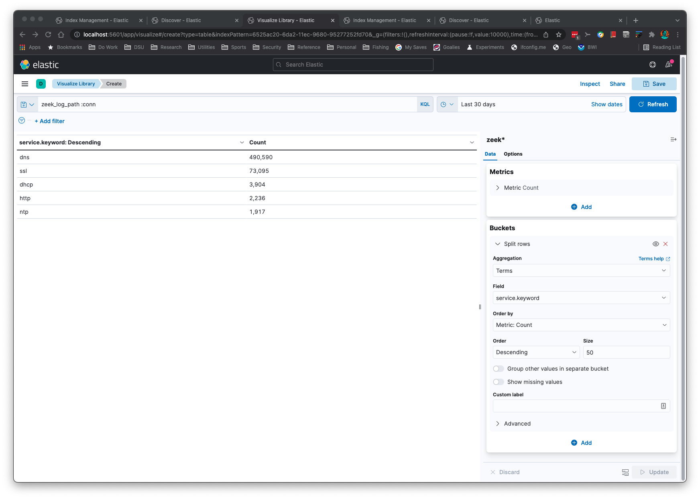

# zeek2es.py

This Python application translates [Zeek's](https://zeek.org/) ASCII TSV and JSON
logs into [ElasticSearch's bulk load JSON format](https://www.elastic.co/guide/en/elasticsearch/reference/current/getting-started.html#add-multiple-documents).

## Table of Contents:
- [Introduction](#introduction)
- [Installation](#installation)
- [Command Line](#commandline)
- [Command Line Options](#commandlineoptions)
- [Requirements](#requirements)
- [Notes](#notes)
  - [Upgrading zeek2es](#upgradingzeek2es)
  - [ES Ingest Pipeline](#esingestpipeline)
  - [JSON Log Input](#jsonloginput)

## Introduction <a name="introduction" />



You can perform subnet searching on Zeek's 'addr' type:


You can create time series graphs, such as this NTP and HTTP graph:


IP Addresses can be Geolocated with the `-g` command line option:


Aggregations are simple and quick:



This application will "just work" when Zeek log formats change.  The logic reads
the field names and associated types to set up the mappings correctly in
ElasticSearch.

This application will recognize gzip or uncompressed logs.  This application assumes 
you have ElasticSearch set up on your localhost at the default port.
If you do not have ElasticSearch you can output the JSON to stdout with the `-s -b` command line options
to process with the [jq application](https://stedolan.github.io/jq).

This program will output date and times in GMT time zone.  You can change the input with the `-m`
command line option with any timezone listed by the following Python program:

```
import pytz
print(pytz.all_timezones)
```

You can add a keyword subfield to text fields with the `-k` command line option.  This is useful
for aggregations in Kibana.

Also, no other Python libraries are needed to run this application.  If Python
is already on your system, there is nothing additional for you to copy over
to your machine than [Elasticsearch, Kibana](https://www.elastic.co/start), and [zeek2es.py](zeek2es.py).

## Installation: <a name="installation" />

There is none.  You just copy [zeek2es.py](zeek2es.py) to your host and run it with Python.  If you are upgrading,
please see [the notes section on upgrading zeek2es](#upgradingzeek2es).

## Command Line: <a name="commandline" />

```
python zeek2es.py your_zeek_log.gz -i your_es_index_name
```

This script can be run in parallel on all connection logs, 10 at a time, with the following command:

```
find /some/dir -name “conn*.log.gz” | parallel -j 10 python zeek2es.py {1} :::: -
```

If you have the jq command installed you can perform searches across all your logs for a common
field like connection uid, even without ElasticSearch:

```
find /usr/local/var/logs -name "*.log.gz" -exec python ~/Source/zeek2es/zeek2es.py {} -s -b -z \; | jq -c '. | select(.uid=="CLbPij1vThLvQ2qDKh")'
```

You can use much more complex jq queries than this if you are familiar with jq.

If you want to remove all of your Zeek data from ElasticSearch, this command will do it for you:

```
curl -X DELETE http://localhost:9200/zeek*
```

Since the indices have the date appended to them, you could
delete Dec 31, 2021 with the following command:

```
curl -X DELETE http://localhost:9200/zeek_*_2021-12-31
```

You could delete all conn.log entries with this command:

```
curl -X DELETE http://localhost:9200/zeek_conn_*
```

## Command Line Options: <a name="commandlineoptions" />

```
$ python zeek2es.py -h
usage: zeek2es.py [-h] [-i ESINDEX] [-u ESURL] [-l LINES] [-n NAME] [-m TIMEZONE] [-k KEYWORDS] [-g] [-j] [-r] [-t] [-s] [-b] [-z] filename

Process Zeek ASCII logs into Elasticsearch.

positional arguments:
  filename              The Zeek log in *.log or *.gz format. Include the full path.

optional arguments:
  -h, --help            show this help message and exit
  -i ESINDEX, --esindex ESINDEX
                        The Elasticsearch index name.
  -u ESURL, --esurl ESURL
                        The Elasticsearch URL. (default: http://localhost:9200/)
  -l LINES, --lines LINES
                        Lines to buffer for RESTful operations. (default: 10,000)
  -n NAME, --name NAME  The name of the system to add to the index for uniqueness. (default: empty string)
  -m TIMEZONE, --timezone TIMEZONE
                        The time zone of the Zeek logs. (default: GMT)
  -k KEYWORDS, --keywords KEYWORDS
                        A comma delimited list of text fields to add a keyword subfield. (default: service)
  -g, --ingestion       Use the ingestion pipeline to do things like geolocate IPs and split services. Takes longer, but worth it.
  -j, --jsonlogs        Assume input logs are JSON.
  -r, --origtime        Keep the numerical time format, not milliseconds as ES needs.
  -t, --timestamp       Keep the time in timestamp format.
  -s, --stdout          Print JSON to stdout instead of sending to Elasticsearch directly.
  -b, --nobulk          Remove the ES bulk JSON header. Requires --stdout.
  -z, --supresswarnings
                        Supress any type of warning. Die stoically and silently.
```

## Requirements: <a name="requirements" />

- A Unix-like environment (MacOs works!)
- Python

## Notes: <a name="notes" />

### Upgrading zeek2es <a name="upgradingzeek2es" />

Most upgrades should be as simple as copying the newer [zeek2es.py](zeek2es.py) over 
the old one.  In some cases, the ES ingest pipeline required for the `-g` command line option 
might change during an upgrade.  Therefore, it is strongly recommend you delete 
your [ingest pipeline](#esingestpipeline) before you run a new version of zeek2es.py.

### ES Ingest Pipeline <a name="esingestpipeline" />

If you need to [delete the "zeekgeoip" ES ingest pipeline](https://www.elastic.co/guide/en/elasticsearch/reference/current/delete-pipeline-api.html) 
used to geolocate IP addresses with the `-g` command line option, you can either do it graphically
through Kibana's Stack Management->Ingest Pipelines or this command will do it for you:

```
curl -X DELETE "localhost:9200/_ingest/pipeline/zeekgeoip?pretty"
```

This command is strongly recommended whenever updating your copy of zeek2es.py.

### JSON Log Input <a name="jsonloginput" />

Since Zeek JSON logs do not have type information like the ASCII TSV versions, only limited type information 
can be provided to ElasticSearch.  You will notice this most for Zeek "addr" log fields that 
are not id$orig_h and id$resp_h, since the type information is not available to translate the field into 
ElasticSearch's "ip" type.  Since address fields will not be of type "ip", you will not be able to use 
subnet searches, for example, like you could for the TSV logs.  Saving Zeek logs in ASCII TSV 
format provides for greater long term flexibility.